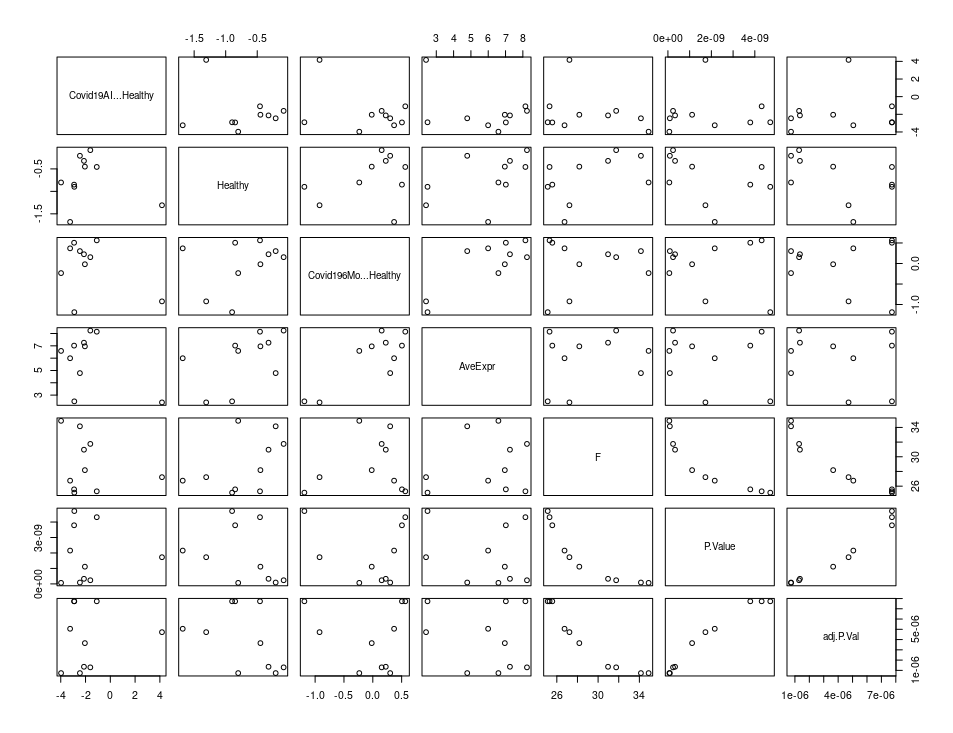

# activity 1

---

-   How would you compare the results between voom and trend?

If we just compare data from top-10 genes, the results between voom and trend have obvious differences.

<p align="center">
    
</p>

However, when we compare all the genes,

<p align="center">
    
</p>

they are generally similar.
Here, we introduce the correlation coefficient to evaluate such a difference between two types of results.
The Spearman coefficient is 0.9781146.

-   Is it required to run more than analysis?

We choose to run both and compare the results, 
looking for consistency in findings as well as 
assessing the statistical significance and effect sizes 
of differentially expressed genes. 
Since the results are concordant, 
we can directly report those from Voom. 
If results differ notably, further investigation or justification 
for the chosen method would be needed.

-   What exactly are we asking with this differential expression?

With the differential expression analysis presented in the R code snippet, 
we are essentially asking which genes show statistically significant changes 
in their expression levels across different states or conditions.
In this particular case, the output of these analyses can provide insights into the biological processes 
involved in each stage of the disease. 

# activity 2

---

-   Plan the next analysis: questions, steps,...

Here, we conducted differential expression analysis after RNA sequencing data processing, 
utilizing several Bioconductor packages and extracting lists of significantly 
differentially expressed genes.

```{r}

library(clusterProfiler)
library(msigdbr)
library(org.Hs.eg.db)
library(magrittr)

v <- voom(dge, design, plot=TRUE)
colnames(design) <- c("Intercept","Covid196Mo","Covid19AI","Healthy")
fit <- lmFit(v, design)

contrast.matrix <- makeContrasts(Covid19AI-Healthy, Healthy, Covid196Mo-Healthy, levels=design)

fit2 <- contrasts.fit(fit, contrast.matrix)
fit2 <- eBayes(fit2)
topTable(fit2) 
topTable(fit2,coef=1) 
topTable(fit2,coef=2) 
topTable(fit2,coef=3) 
topTable(fit2,coef=4) 
```

First of all, we load relevant libraries. 
Then, we perform voom transformation. 
After that, we define design matrix and fitting linear models.
When we finished them, we apply contrast matrix and Bayesian correction.
Finally, we extract significantly different genes.

For different number of coefficient, the results are as followed:

If the coefficient parameter is default:

<p align="center">
    
</p>

If the coefficient parameter is set as 1:

<p align="center">
    
</p>

If the coefficient parameter is set as 2:

<p align="center">
    
</p>

If the coefficient parameter is set as 3:

<p align="center">
    
</p>

If the coefficient parameter is set as 4, an error mentioned that "index is out of bound", 
since we do not have 4 comparable items.

# ORA and Gene Set Enrichment analysis

---

-   What do we need to do the analysis?

1. Gene Expression Data:
We require a list of differentially expressed genes resulting from our differential expression analysis. 
These differentially expressed genes are usually ranked based on statistical significance and/or fold change.

2. Gene Sets Database: 
We choose a curated database containing collections of genes grouped together based on common biological functions, 
pathways, or chromosomal locations. Popular databases include Gene Ontology (GO), 
Kyoto Encyclopedia of Genes and Genomes (KEGG), Reactome, and MSigDB (used in GSEA).

3. Over-Representation Analysis (ORA):
We load the selected gene sets database using a compatible package in R,
like org.Hs.eg.db for GO terms or clusterProfiler for multiple databases.
We test whether the DEGs are significantly overrepresented within any gene set 
compared to a background gene set.
We perform Fisher's exact test, hypergeometric test, 
or chi-square test to calculate p-values 
and adjust them for multiple testing corrections (e.g., FDR).

4. Gene Set Enrichment Analysis (GSEA):
We use a GSEA-compatible tool like fgsea or gage in R.
We rank all genes in the dataset based on their correlation with the phenotype of interest.
Walk through the ranked list and calculate an enrichment score (ES) for each gene set, 
indicating whether members of the set tend to occur towards the top or bottom of the ranked list.
Assess statistical significance by permutation tests to generate null distributions and 
compute nominal p-values and adjusted p-values (e.g., FDR).


```{r}
# Assuming 'de_genes' is a character vector of DEGs
# And we've loaded org.Hs.eg.db and clusterProfiler

# ORA
enrichResult <- enrichGO(de_genes, 
                        universe = rownames(dge), 
                        OrgDb = org.Hs.eg.db, 
                        keyType = "ENSEMBL",
                        ont = "BP", # Biological Process
                        pAdjustMethod = "BH" # Benjamini-Hochberg correction
                       )

# Summary of ORA results
summary(enrichResult)

# Plotting ORA results
dotPlot(enrichResult)

# For GSEA, we use a function from a GSEA-capable package using fgsea:
library(fgsea)
result <- fgseaPathway(geneRanks = rank(dge[, de_genes]), 
                      pathways = gmtPathways, # Our gene sets file
                      minSize = 15, 
                      maxSize = 500,
                      nperm = 1000)

# Look at the top enriched pathways
head(result)
```

-   What are the tools required?

1. Bioconductor Packages:
clusterProfiler, fgsea, or other alternatives for GSEA include gage and ENRICHR.

2. Gene Set Databases: 
We need access to gene set databases, like MSigDB and Reactome.

3. Background Gene List: 
For ORA, we need a complete list of genes to serve as the background set against 
which the differentially expressed genes are tested for over-representation.

4. Permutation Tests and Multiple Testing Correction: 
Tools like clusterProfiler and fgsea come with built-in functions to perform permutation tests 
for assessing significance and adjust p-values for multiple testing corrections, 
such as the Benjamini-Hochberg procedure.

# alternatives to KEGG 

---

There are several alternative databases and resources available for pathway analysis and gene set enrichment:

- Reactome: A curated knowledgebase of biological pathways that provides a systems view of the cell.

- Gene Ontology (GO): A controlled vocabulary that annotates genes and gene products 
in terms of their associated biological processes, cellular components, and molecular functions. 

- WikiPathways: An open, collaborative platform for curating biological pathways. 

- MSigDB: The Molecular Signatures Database from the Broad Institute includes curated gene sets 
collected from various sources such as publications, GO, and KEGG. 

- Biocarta: A collection of manually curated signaling pathways, 
though it has been discontinued and absorbed into Reactome.

- ConsensusPathDB: A resource for integrated interaction networks and functional analysis 
covering humans, mouse, and rat. 

# compare GSEA versus ORA

---

ORA and GSEA are both widely used methods in bioinformatics 
to interpret high-throughput genomic data in the context of 
known biological pathways or functional categories. 

ORA looks at a pre-defined set of genes and checks 
whether the number of differentially expressed genes in 
these sets is significantly higher than expected by chance. 
It is a "top-down" approach.
Its advantages and limitations are shown below:
- It directly tests whether the predefined gene set contains too many differentially expressed genes, 
making it easy to interpret the results. Compared to GSEA, ORA has lower computational intensity, 
which is advantageous for large datasets or limited computing resources.
- If a gene set exhibits subtle but coordinated changes that do not result in many genes reaching 
statistical significance alone, 
then biologically significant changes may be missed.

GSEA ranks all genes based on their association with the phenotype like correlation with the treatment effect. 
Then, it walks through the ranked list and calculates an enrichment score for each gene set, 
considering the position of its member genes in the ranking. 
It is a "bottom-up" approach.
Its advantages and limitations are shown below:
- It can detect synergistic changes in gene expression throughout the entire pathway, 
thereby capturing subtle but crucial changes that may be overlooked by ORA. 
In addition, it can also consider the directionality of expression changes, 
which adds valuable insights to the overall regulation of biological processes.
- Its results may be highly sensitive to the selection of methods and parameters used for gene sorting, 
such as the number of permutations, minimum gene set size, etc. 
This requires careful consideration and calibration of these factors 
to ensure the validity and reliability of GSEA survey results.

ORA is a hypothesis-driven approach that focuses on genes meeting a stringent statistical cutoff, 
while GSEA is a hypothesis-generating method that can detect enrichment patterns 
without requiring genes to meet strict statistical thresholds. 
GSEA is often considered more powerful because it can uncover subtle biological signals, 
but it also requires more computation and is sensitive to parameter settings.